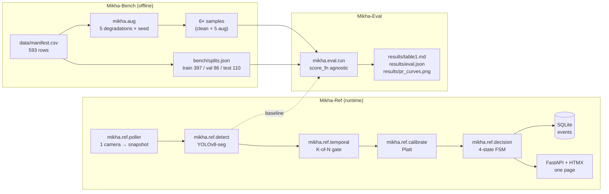

# Mikha-511

> Open-source reference implementation for flooded-road detection on public traffic-camera imagery, released together with the first publicly available degradation-stratified evaluation benchmark for this task.

**Status:** v0.2.0 - fine-tune release. 593-row bench corpus, reference implementation runnable, fine-tuned water classifier lifts test AUROC from 0.14-0.23 (COCO baseline) to 0.88-0.94 across all five degradation classes.

[]() []() []() []()

---

## Why this exists

Flash flooding is the leading weather-related killer in the United States, and more than half of flood fatalities happen in vehicles that drove onto submerged roads (NWS). Every U.S. state operates a 511 traffic-camera system, and those feeds could in principle be watched during storm events - but no one can watch them all, and existing academic and commercial work reports numbers on clean imagery that don't survive contact with real-world 511 conditions (rain on the lens, night, fog, glare, low-bitrate JPEG artifacts).

Mikha-511 doesn't try to be the state-of-the-art detector. It ships the piece the field is missing: a **public, degradation-stratified evaluation benchmark**, an **open augmentation library** that produces it, and a **minimal, one-laptop reference implementation** that anyone can run and beat.

## What's in the repo

| Package | Role |
|---|---|
| `mikha.aug` | Deterministic, seeded 511-style degradation transforms (rain-on-lens, fog, night, glare, low-bitrate JPEG). |
| `mikha.bench` | Evaluation corpus construction, loading, and manifest tools. Labels ship under CC-BY-4.0; images are represented by source URL + hash to respect upstream licenses. |
| `mikha.ref` | Reference implementation: pretrained YOLOv8-seg detector + temporal-persistence gate + calibrated confidence + a minimal FastAPI/HTMX dashboard for one camera. |
| `mikha.eval` | One-command evaluation harness producing per-degradation-class precision, recall, F1, AUROC, AUPRC, and false-alert rate at fixed recall. |

## Architecture



See [`docs/architecture.md`](docs/architecture.md) for the full component walk-through.

## Results

Same 110-image test split for both rows in each degradation class, same seed, same manifest. The v0.1.0 baseline is off-the-shelf YOLOv8n-seg with COCO weights, scored by `mask_area_frac`. The v0.2.0 fine-tune is an ImageNet-pretrained MobileNetV3-Small classifier trained on the base set in about 25 minutes on a laptop CPU.

| Degradation | N | Model | Precision | Recall | F1 | AUROC | AUPRC | FAR @ 90% Recall |
|---|---:|---|---:|---:|---:|---:|---:|---:|
| clean | 110 | YOLOv8n-seg (v0.1.0) | 0.125 | 0.063 | 0.084 | 0.159 | 0.42 | 0.872 |
| clean | 110 | classifier (v0.2.0)  | 0.833 | 0.873 | 0.853 | 0.923 | 0.95 | 0.277 |
| rain  | 110 | YOLOv8n-seg (v0.1.0) | 0.206 | 0.111 | 0.144 | 0.232 | 0.45 | 0.915 |
| rain  | 110 | classifier (v0.2.0)  | 0.685 | 0.968 | 0.803 | 0.939 | 0.96 | 0.149 |
| fog   | 110 | YOLOv8n-seg (v0.1.0) | 0.143 | 0.063 | 0.088 | 0.143 | 0.43 | 0.787 |
| fog   | 110 | classifier (v0.2.0)  | 0.778 | 0.889 | 0.830 | 0.901 | 0.94 | 0.426 |
| night | 110 | YOLOv8n-seg (v0.1.0) | 0.158 | 0.048 | 0.073 | 0.194 | 0.50 | 0.596 |
| night | 110 | classifier (v0.2.0)  | 0.740 | 0.905 | 0.814 | 0.882 | 0.90 | 0.404 |
| glare | 110 | YOLOv8n-seg (v0.1.0) | 0.125 | 0.063 | 0.084 | 0.143 | 0.41 | 0.872 |
| glare | 110 | classifier (v0.2.0)  | 0.824 | 0.889 | 0.855 | 0.926 | 0.96 | 0.277 |
| jpeg  | 110 | YOLOv8n-seg (v0.1.0) | 0.152 | 0.079 | 0.104 | 0.163 | 0.42 | 0.872 |
| jpeg  | 110 | classifier (v0.2.0)  | 0.833 | 0.873 | 0.853 | 0.924 | 0.96 | 0.298 |

**How to read this.** The v0.1.0 baseline had AUROC below 0.5 on every class, which means `mask_area_frac` was pointing the wrong direction: COCO segmentation finds cars and people, which are more common in non-flood traffic-camera frames than in flood frames. The v0.2.0 fine-tune reverses this by training on actual water. AUROC uplifts range from +0.69 (night) to +0.78 (glare). FAR at 90% recall drops from the 0.60-0.92 range down to 0.15-0.43. See [`docs/results.md`](docs/results.md) for the training curve, threats to validity, and reproduction commands.

## Quickstart

```bash
git clone https://github.com/bibekmhj/mikha-511.git
cd mikha-511
python -m venv .venv && source .venv/bin/activate
pip install -e ".[dev,model]"          # model extras pull ultralytics + torch

# Reproduce the base image set (~15 min on normal home internet):
python scripts/import_eu_flood.py --max-per-class 500 --balance --sleep-ms 1000
python scripts/import_url_list.py --src data/gov_pd_urls.tsv
python scripts/fetch_base.py

# Build train/val/test splits (idempotent given seed):
python scripts/build_splits.py

# Run baseline evaluation on the test split, all 6 degradations:
python scripts/run_eval.py
# → results/table1.md, results/eval.json, results/pr_curves.png

# Smoke run in under a minute (5 flood + 5 nonflood per degradation):
python scripts/run_eval.py --limit-per-class 5

# Live dashboard for one camera:
docker compose up
# → http://localhost:8000
```

Full walk-through, including known egress issues (Wikimedia rate limits, HydroShare terms acceptance) and how to add public-domain rows: [`docs/quickstart.md`](docs/quickstart.md).

## Data provenance and licenses

The `data/manifest.csv` shipped with v0.1.0 contains **593 rows** across four sources:

| Source | Rows | License |
|---|---:|---|
| European Flood 2013 (Wikimedia-hosted; per-image licenses preserved) | 578 | mix of CC-BY-SA-{2.0,2.5,2.5-HU,3.0,3.0-AT,3.0-DE,4.0}, CC-BY-3.0, PublicDomain-Wikimedia |
| USGS Media Library | 11 | PublicDomain-US-Gov (17 USC §105) |
| Ultralytics sample images | 2 | AGPL-3.0 |
| OpenCV extra / samples | 2 | Apache-2.0 / BSD-3-Clause |

Every row's license was verified individually against the upstream source page - never assumed from a paper's abstract. The repo does **not** redistribute images; each row carries a URL and SHA-256, and `scripts/fetch_base.py` reproduces the base set on demand. Attribution strings are preserved per row.

## Prior art

- **ClearObject "ClearFlood"** - proprietary commercial CV on live road/surveillance feeds. Not open source, no benchmark.
- **Rice OpenSafe Fusion** (2024) - multi-source situational-awareness fusion for Houston flooding; broader than a single-camera reference.
- **LSU / Tran-SET USDOT** (2020) - image enhancement + Bayesian filtering on traffic-monitoring cameras; research report, no maintained software.
- **Real-time anticipatory urban flood warning using CCTV and Page–Hinkley change detection** (ScienceDirect, 2026) - single-camera change-detection algorithm.
- **V-FloodNet** (2023) - video segmentation for flood quantification; research prototype.
- **"More eyes on the road"** (Reliability Engineering & System Safety, 2024) - multi-source fusion, not per-camera reference.

Mikha-511's contribution is **infrastructural, not algorithmic**: the benchmark, the augmentation library, and a reproducible baseline these systems can be measured against.

## License

- **Code**: Apache-2.0 (see `LICENSE`).
- **Benchmark labels and manifest**: CC-BY-4.0 (see `LICENSE-DATA`).
- **Images**: not redistributed by this repo. See `data/README.md` for how the base set is reproduced from upstream sources under their own licenses.

## Citation

If you use Mikha-511 or Mikha-Bench in your work, please cite via the `CITATION.cff` in this repository. Zenodo DOIs are issued at each tagged release (v0.1.0 and v0.2.0).

## Non-goals

Kept deliberately narrow. No multi-source fusion, no hydrological modeling, no Kubernetes, no auth, no mobile app, no hosted SaaS, no second detector architecture in v0.1.

## Roadmap

- [x] M0 - repo scaffold, licenses, CI, package structure
- [x] M1 - PoC: one FL511 camera to pretrained YOLOv8-seg overlay
- [x] M2 - Mikha-Aug (5 degradations, deterministic, tested)
- [x] M3 - Manifest schema + fetch/verify tooling + import scripts (EF2013, HydroShare, US-Gov PD list)
- [x] M4 - Mikha-Bench v0: 593-row corpus + group-aware train/val/test splits
- [x] M5 - Mikha-Ref v0: detector + K-of-N persistence gate + Platt calibration + FastAPI/HTMX dashboard + SQLite events
- [x] M6 - Evaluation harness + baseline results table
- [x] M7 - Docs, results, v0.1.0 release
- [x] M8 - Fine-tuned water classifier + v0.2.0 release (clean AUROC 0.923, all-degradation min AUROC 0.882)
- [ ] v0.3 - Real FL 511 / TX 511 held-out evaluation (labels only shipped; images not rehosted); explore larger backbones if the corpus grows

See the project-level plan for the full scope contract.
