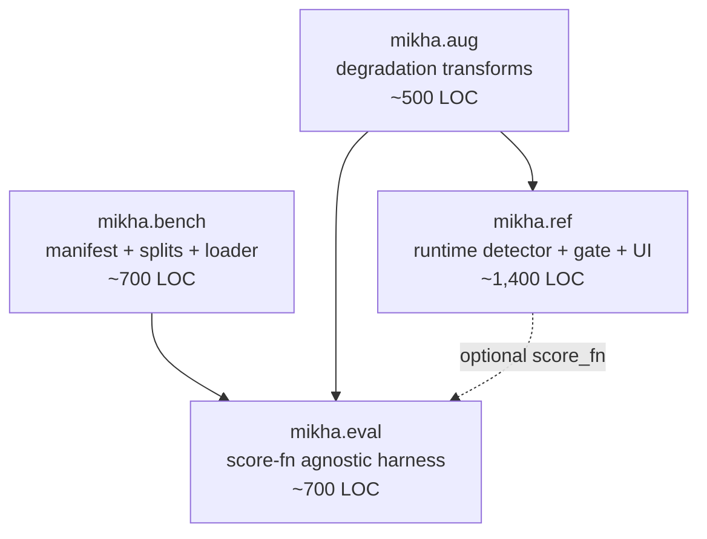
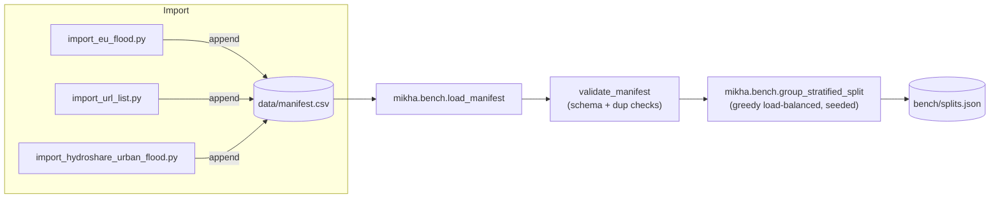
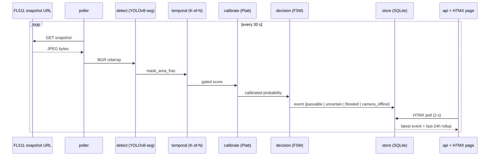
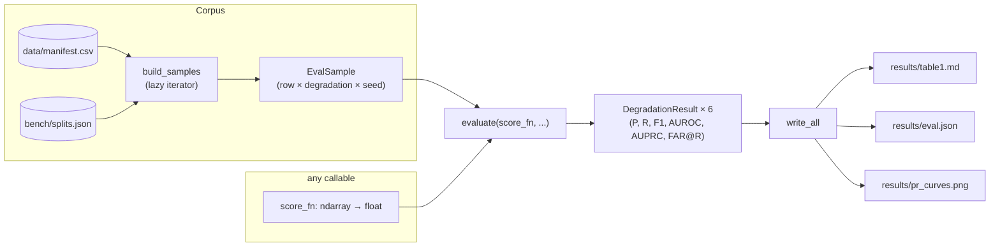

# Architecture

Mikha-511 is intentionally one Python package (`src/mikha/`) with four sub-packages, one FastAPI process, and one SQLite file. This document describes what each piece does, how the pieces connect, and where the boundaries are.

## Top-level packages

Nothing else exists in the code namespace. If it needs to grow beyond these four, cut something first.

## `mikha.aug` — deterministic degradations

Five transforms, each a pure function `apply(image: ndarray, severity: float, rng: Generator) -> ndarray`:

- `rain.py` — elongated Gaussian-blurred droplets on lens plane, 2–15 % occlusion at s=0.65
- `fog.py` — depth-independent alpha-blended overlay + local contrast reduction
- `night.py` — gamma + hue shift + Poisson noise floor
- `glare.py` — additive Gaussian lens flare at random position + local saturation clip
- `jpeg.py` — encode → decode round-trip at Q=15–35

Each transform is deterministic given `(image, severity, seed)`. The `EvalSample.load()` in `mikha.eval.corpus` composes seed = `sha256(row_id) ^ eval_seed` so identical eval runs produce byte-identical degraded images.

## `mikha.bench` — manifest and splits

The manifest is the single source of truth. Every row carries `id`, `source`, `url`, `sha256`, `license`, `attribution`, `image_class`, and `notes`. Validation refuses:
- unknown license (must be in the vocabulary in `data/README.md`),
- duplicate `id`,
- duplicate `sha256`,
- malformed columns.

Splits are computed **from groups**, not rows. A group is a `(source, uploader-or-photographer)` tuple derived from the attribution string; this prevents a single prolific Wikimedia uploader (Matěj Baťha at ~19 % of the EF2013 corpus) from leaking across splits. The algorithm is greedy load-balancing: sort groups by size descending (ties broken by seeded shuffle), then place each group in whichever split is emptiest by fill-ratio-to-target.

## `mikha.ref` — runtime reference implementation

**Persistence gate** (`temporal.py`) — ring buffer of length N=10; alert only if the gated score exceeds θ in ≥ K=6 of the last 10 frames. Hysteresis is asymmetric: raise fast, lower slow (a grace window prevents flapping on a single "clean" frame).

**Calibration** (`calibrate.py`) — Platt scaling `σ(A·score + B)` fit on the validation split; ECE and reliability diagram are reported alongside `results/table1.md` after any refit.

**Decision** (`decision.py`) — a 4-state finite-state machine over the calibrated probability + a camera-liveness signal:
- `passable` — probability below θ_low
- `flooded_uncertain` — between θ_low and θ_high
- `flooded` — above θ_high AND persistence gate satisfied
- `camera_offline` — poller has not received a frame in > T seconds

**UI** (`api.py` + `ui/`) — one FastAPI process, one HTMX page, no build step, no auth. Deliberately not React.

**Storage** (`store.py`) — one SQLite file (`events.sqlite`). One table: `events(id, ts, camera_id, decision, probability, mask_area_frac, note)`.

## `mikha.eval` — evaluation harness

The harness is **detector-agnostic**. `score_fn` is `Callable[[np.ndarray], float]` returning a scalar in `[0, 1]`. Baseline uses `YoloDetector.detect(image).mask_area_frac`; a fine-tuned head would provide `water_probability`. The eval infra tests never import torch, so `pytest -q` runs in under two seconds without the model extras installed.

## Runtime dependencies

Core (always required): `numpy`, `opencv-python-headless`, `httpx`, `pydantic`.
Bench (import scripts): adds nothing beyond core.
Ref (`.[model]`): adds `ultralytics`, `torch`.
API (`.[api]`): adds `fastapi`, `uvicorn`, `jinja2`.
Dev: adds `pytest`, `ruff`.

`mikha.eval` and `mikha.bench` deliberately depend on only the core set, so the benchmark and the eval harness can be run and tested without pulling torch.

## What is deliberately absent

- No message broker (Kafka / Redis / etc.).
- No container orchestrator beyond `docker-compose up`.
- No user auth.
- No multi-camera correlation, no hydrological modeling.
- No RTSP streaming — the poller pulls snapshot URLs, which is what every state 511 exposes.
- No second detector architecture. If YOLOv8-seg proves inadequate after fine-tune, the v0.2 replacement is SAM 2 with a water prompt, still swapped behind the `ScoreFn` seam.
